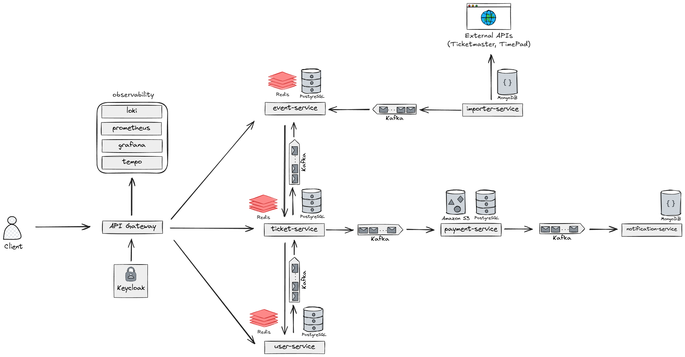

# Booking Platform

Booking Platform is a distributed commerce system for publishing, importing, booking, and selling live experiences such as events, workshops, classes, and local activities.

The platform models the full booking lifecycle: organizers publish bookable inventory, customers reserve tickets, payments are processed asynchronously, PDF receipts are stored in S3-compatible storage, and users receive transactional notifications. The system is built as a microservice architecture with reliable event publishing, GDPR-aware data handling, API gateway security, and local observability.

## Capabilities

- Public API gateway with Keycloak JWT validation and role-based access control.
- Organizer workflows for creating and managing bookable events.
- Ticket reservation, activation, cancellation, and availability tracking.
- Saga choreography for the booking and payment flow.
- Transactional outbox and idempotent Kafka consumers for reliable asynchronous processing.
- Payment lifecycle management with PDF receipt generation and S3-compatible receipt storage.
- Notification delivery pipeline for payment and booking lifecycle events.
- External catalog import flow for Ticketmaster and Timepad-style sources.
- Redis caching for frequently requested data.
- GDPR-oriented user deletion flow with envelope encryption, DEK/KEK handling, and crypto-shredding.
- OpenAPI documentation aggregated through the gateway.
- Docker Compose, Kubernetes manifests, GitHub Actions CI, CodeQL, Sonar analysis, and observability stack.

## Architecture



## Services

| Service | Responsibility |
| --- | --- |
| `api-gateway` | Public entry point, routing, JWT validation, RBAC, correlation IDs, OpenAPI aggregation |
| `user-service` | User records, per-user encryption keys, GDPR deletion and crypto-shredding |
| `event-service` | Bookable event catalog, organizer workflows, capacity, availability, cancellation |
| `ticket-service` | Ticket reservation, encrypted ticket payloads, ticket state transitions |
| `payment-service` | Payment lifecycle, receipt generation, S3-compatible receipt storage |
| `notification-service` | Asynchronous transactional notifications |
| `importer-service` | External source imports into the booking catalog |

Supporting infrastructure includes PostgreSQL, MongoDB, Kafka, Redis, Keycloak, LocalStack, Prometheus, Grafana, Loki, Tempo, and the OpenTelemetry Collector.

## Repository Layout

```text
api-gateway/           # public gateway, RBAC, OpenAPI aggregation
user-service/          # users, encryption keys, GDPR deletion
event-service/         # bookable catalog, capacity, organizer workflows
ticket-service/        # bookings, tickets, encrypted ticket payloads
payment-service/       # payments, receipts, S3 storage
notification-service/  # MongoDB-backed asynchronous notification records
importer-service/      # Java-based MongoDB-backed external catalog imports
docs/                  # architecture and smoke-test documentation
k8s/                   # Kubernetes base manifests
keycloak/              # local realm import
observability/         # Prometheus, Grafana, Loki, Tempo, OTel config
scripts/               # local helper and smoke-test scripts
```

## Local Ports

| Component | Port | Purpose |
| --- | --- | --- |
| API Gateway | `8083` | Public HTTP API and Swagger UI |
| User Service | `8080` | User and key-management API |
| Ticket Service | `8081` | Booking and ticket API |
| Event Service | `8082` | Bookable catalog API |
| Payment Service | `8084` | Payment and receipt API |
| Notification Service | `8085` | Notification lookup API |
| Importer Service | `8086` | External catalog import API |
| Keycloak | `8088` | Local identity provider |
| Kafka | `19092` | External Kafka listener |
| Redis | `6379` | Local cache |
| Notification MongoDB | `27017` | Notification document store |
| Importer MongoDB | `27018` | Import history document store |
| LocalStack | `4566` | S3-compatible local storage |
| Grafana | `3000` | Observability dashboards |
| Prometheus | `9090` | Metrics and alerts |
| Loki | `3100` | Log storage |
| Tempo | `3200` | Trace storage |

## Distributed Flow

The main booking flow is implemented with saga choreography. Services publish domain events through transactional outbox tables and consume Kafka messages idempotently, which keeps service-owned databases isolated while maintaining eventual consistency across ticket, payment, receipt, and notification workflows.

## Security And Privacy

- Keycloak is used for authentication and role-based access control.
- The gateway forwards trusted authenticated user context to downstream services.
- Sensitive user-related payloads are encrypted with per-user DEKs.
- DEKs are encrypted at rest with a service-level KEK.
- User deletion triggers asynchronous cleanup in dependent services and removes key material to make encrypted personal data unrecoverable.

## Local Run

Create required local secrets in your shell or an ignored `.env` file:

```bash
export KEYCLOAK_ADMIN_PASSWORD='<local keycloak admin password>'
export APP_SECURITY_KEK_BASE64="$(openssl rand -base64 32)"
```

Start the stack:

```bash
docker compose up --build
```

The API gateway listens on:

```text
http://localhost:8083
```

Swagger UI is available through the gateway:

```text
http://localhost:8083/swagger-ui.html
```

## Smoke Checks

Run the end-to-end booking flow:

```bash
export E2E_USER_PASSWORD='<temporary e2e user password>'
./scripts/e2e-purchase-flow.sh
```

Check observability components and service scrape targets:

```bash
./scripts/observability-smoke.sh
```

## Build

Each service is built independently:

```bash
cd user-service
./gradlew clean test bootJar --no-daemon --stacktrace
```

The CI pipeline runs the same build and test command through a GitHub Actions matrix for all services.

## Documentation

- [API Gateway](api-gateway/README.md)
- [User Service](user-service/README.md)
- [Event Service](event-service/README.md)
- [Ticket Service](ticket-service/README.md)
- [Payment Service](payment-service/README.md)
- [Notification Service](notification-service/README.md)
- [Importer Service](importer-service/README.md)
- [E2E Purchase Flow](docs/e2e.md)
- [Observability](docs/observability.md)
- [Kubernetes](k8s/README.md)
- [Scripts](scripts/README.md)
